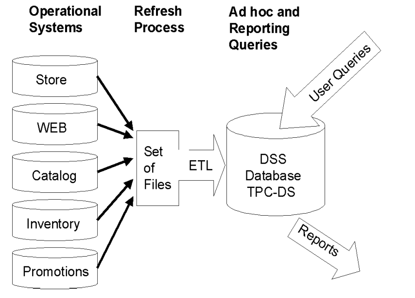

# TPC-DS Benchmarking Over Microsoft Azure
## Introduction 
TPC-DS stands for the Decision-Support benchmark that was designed by the Transaction Processing Performance Council (TPC). 
The purpose of TPC benchmarks is to provide relevant and objective performance measures to industry users. To achieve that purpose, TPC benchmark specifications require benchmark tests to be implemented with systems, products, technologies and pricing that: 
I. Are generally available to users;
II. Are relevant to the market segment that the individual TPC benchmark models or represents (e.g., TPC-DS) models and represents complex, high volume data in decision support environments);
III: Would plausibly be implemented by a significant number of users in the market segment
modelled or represented by the benchmark.

## What is the TPC-DS?
The TPC Benchmark DS (TPC-DS) is a decision support benchmark that models several generally applicable aspects of a decision support system, including queries and data maintenance. (TPC-DS Specification).

## Why TPC-DS?
The **TPC-DS** benchmark illustrates decision support systems that:
* Examine large volumes of data
* Give answers to real-world business questions
* Execute queries of various operational requirements and complexities (e.g., ad-hoc, reporting, iterative OLAP, data mining)
* Are characterized by high CPU and IO load
* Are periodically synchronized with source OLTP databases through database maintenance functions
* **Run on “Big Data” solutions, such as RDBMS, Microsoft Azure as well as Hadoop/Spark based systems.**

## Business Model 

TPC-DS models any industry that must manage, sell and distribute products (e.g., food, electronics, furniture, music and toys etc.). It utilizes the business model of a large retail company having multiple stores located nationwide. Beyond its brick and mortar stores, the company also sells goods through catalogs and the Internet. Along with tables to model the associated sales and returns, it includes a simple inventory system and a promotion system. 

## Benchmark Components

TPC-DS models the decision support functions of a retail product supplier. The supporting schema contains vital business information, such as customer, order, and product data. The benchmark models process user requests by converting factual information into useful business insights and keep the data updated by synchronizing the management analysis process with the external data source it relies on.
The various components of the benchmark are given below  

Examples of business processes of where TPC-DS models are:
* Record customer purchases (and track customer returns) from any sales channel
• Modify prices according to promotions
• Maintain warehouse inventory
• Create dynamic web pages
• Maintain customer profiles (Customer Relationship Management)

## Query Classes
TPC-DS has defined four broad classes of queries that characterize most decision support systems: 
* **Reporting queries**: These queries capture the “reporting” nature of a DSS system.
* **Ad hoc queries**: These queries capture the dynamic nature of a DSS system in which impromptu queries are constructed to
answer immediate and specific business questions.
* **Iterative OLAP queries**: OLAP queries allow for the exploration and analysis of business data to discover new and meaningful
relationships and trends
* **Data mining queries**: These queries facilitates the process of filtering through large amounts of data to produce data content relationships

TPC-DS provides a wide variety of queries in the benchmark to emulate these diverse query
classes.

## Implementation 

In this project we implements TPC-DS benchmark on Microsoft Azure SQL Database. 

The benchmark was run on the following scales: 
- 1 GB
- 2 GB
- 5 GB
- 100 GB

The run-times of 99 queries were recorded. 

